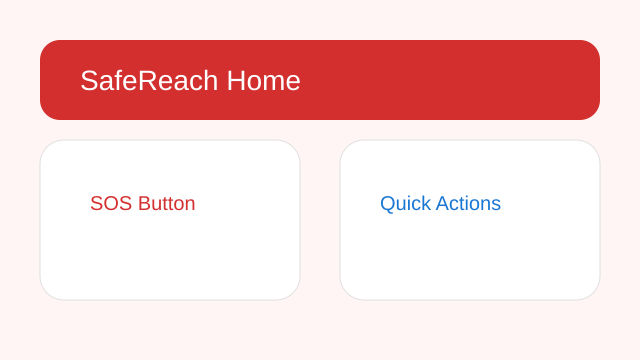
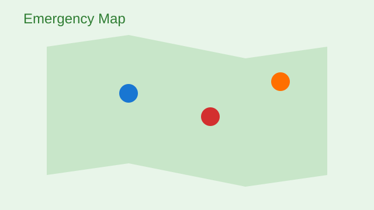
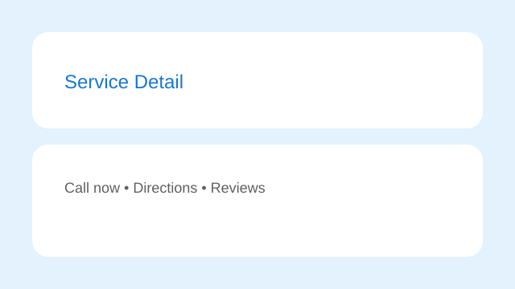

# SafeReach Emergency App (Flutter)

SafeReach is a high-contrast, accessibility-first emergency app. It helps users find nearby police, hospitals, fire stations, ambulances, women's helplines, and disaster relief contacts in seconds.

## Screenshots





## Features

- High-contrast Material 3 theme (light + dark)
- Onboarding (3 slides) on first launch
- Bottom navigation with 5 primary tabs
- SOS big button with pulsing animation
- Service list + detail with call/directions actions
- Favorites with swipe-to-remove (shared_preferences)
- Personal emergency contacts (add/edit/delete)
- Nearby filters (category, open now, distance)
- Flutter Map with service markers and bottom sheet details
- First-aid tips with step-by-step instructions
- Loading shimmers, empty states, and error placeholders
- Smooth transitions + hero animations

## Tech Stack

- Flutter 3.x / Dart 3.x (Material 3)
- State: Provider
- Navigation: go_router
- Local storage: shared_preferences
- Map: flutter_map
- Images: bundled SVG assets + cached_network_image
- Backend API data with local JSON fallback for offline/demo safety

## Getting Started

```bash
flutter pub get
flutter run
```

## Folder Structure

```
lib/
  main.dart
  app.dart
  theme/
  router/
  models/
  data/
  state/
  features/
  widgets/
  utils/
assets/
  images/
  icons/
  mock/
```

## Notes

- In-app splash uses `assets/images/splash_logo.svg`.
- App icon artwork is in `assets/icons/app_icon.svg`.
